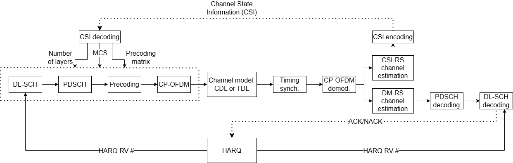
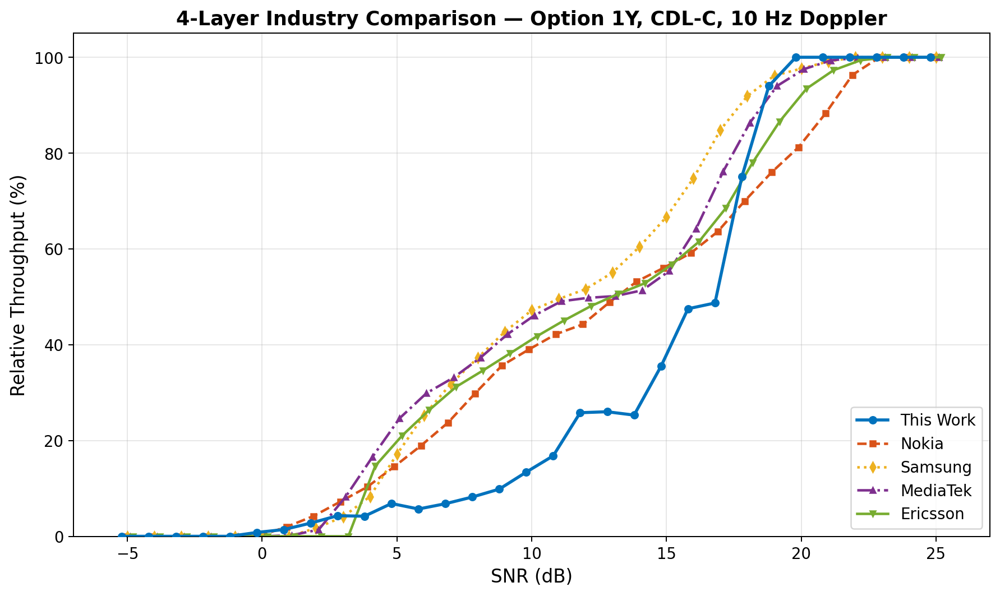
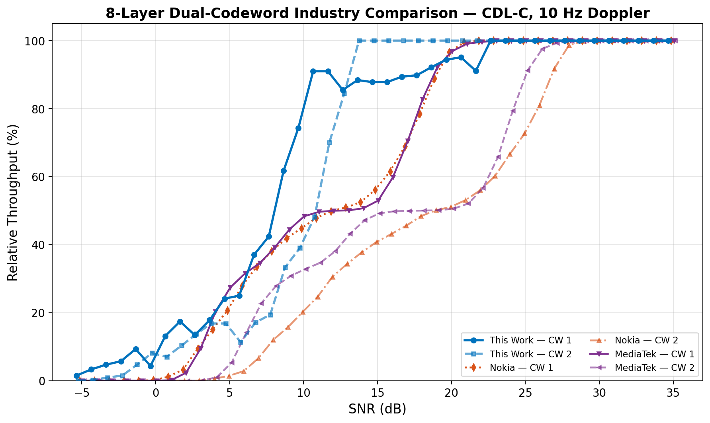
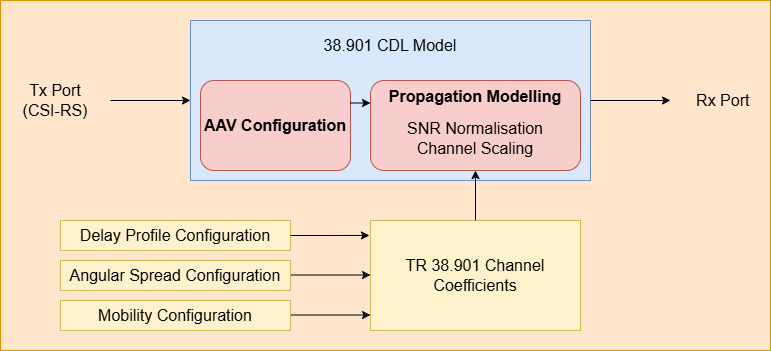

# Performance Evaluation of CDL Channel Models in a 5G NR Downlink End-to-End Simulation

**MEng (IIB) Dissertation — University of Cambridge, Department of Engineering (2024–2025)**


> A MATLAB-based end-to-end 5G NR downlink link-level simulation framework for evaluating Physical Downlink Shared Channel (PDSCH) performance under 3GPP-standardised Clustered Delay Line (CDL) channel models, with results benchmarked against 9 industry vendors.

---

## System Architecture

<p align="center">
  
</p>
<p align="center"><em>End-to-end processing chain: DL-SCH encoding → PDSCH → Precoding → CP-OFDM → CDL/TDL Channel → Receiver (timing sync, demodulation, channel estimation, decoding) with CSI feedback and HARQ retransmission loops.</em></p>

---

## About

This project was completed as a 4th-year Master of Engineering (MEng/IIB) dissertation at the University of Cambridge in collaboration with **Nokia Bell Labs**. It develops a configurable, 3GPP-compliant simulation framework to evaluate how standardised CDL fading environments — defined in 3GPP TR 38.901 — impact downlink throughput and block error rate (BLER) under realistic conditions including HARQ, imperfect CSI feedback, and practical channel estimation.

The work is motivated by ongoing **3GPP RAN4 standardisation efforts** (Release 19, TR 38.753) to define spatial channel models for demodulation performance requirements. Simulation results are compared against industry data from **Apple, BT, Ericsson, Huawei, MediaTek, Nokia, Qualcomm, Samsung, and ZTE**, providing independent academic validation of vendor-reported performance.

**Author:** Ian Cho ([Pembroke College](https://www.pem.cam.ac.uk/))
**Supervisors:** Prof. Albert Guillen i Fabregas (Cambridge), Alexander Hamilton (Nokia Bell Labs)

---

## Key Features

- **3GPP-compliant PDSCH simulation** following TS 38.211, TS 38.212, and TS 38.214
- **CDL channel models** (CDL-A through CDL-E) from TR 38.901 with configurable delay spread, angular spread, and Doppler
- **Up to 8-layer SU-MIMO** with Type-1 single-panel and multi-panel codebook precoding
- **HARQ retransmissions** — 8 parallel processes, RV sequence {0, 2, 3, 1}, soft combining with LDPC decoding
- **CSI feedback modes** — RI/PMI/CQI codebook reporting, AI-based CSI compression, and perfect CSI
- **Channel estimation** — perfect (genie-aided) and practical (DM-RS least-squares) estimators
- **Subarray virtualisation** — maps 512 physical antenna elements to 8 CSI-RS virtual ports using beamsteering vectors (3GPP Option 1Y)
- **Parallel computing** — `parfor` SNR sweeps across up to 31 workers on AWS EC2 (r6i.8xlarge)
- **Industry benchmarking** — results compared against 9 vendors from 3GPP RAN4 meetings #113–#115

---

## Key Results

### CDL Channel Profile Comparison

Different CDL profiles produce significantly different throughput characteristics depending on angular spread and deployment scenario:

- **CDL-C** (dense urban NLOS, 300 ns delay spread) yields the highest throughput due to rich angular spread and strong multipath
- **CDL-E** (strong LOS) is limited by single dominant eigenmode at lower SNRs
- **CDL-A** (urban microcell NLOS) underperforms due to wide angular spread misaligning with the simulated narrow-beam configuration

### Feature Impact Analysis

| Feature | SNR Gain at 30% Throughput | SNR Gain at 70% Throughput |
|---------|---------------------------|---------------------------|
| HARQ retransmissions | +2.0 dB | +1.5 dB |
| Perfect vs. LS channel estimation | +2.0 dB | +2.0 dB |
| Ideal vs. realistic assumptions | +5.0 dB | +8.0 dB |
| 10 Hz vs. 100 Hz Doppler | +2.0 dB | +5.0 dB |

### Industry Alignment — 4-Layer, Option 1Y

<p align="center">
  
</p>
<p align="center"><em>Throughput vs. SNR comparison for 4-layer MIMO (Option 1Y, CDL-C, 10 Hz Doppler) — our simulation ("This Work") benchmarked against Nokia, Samsung, MediaTek, and Ericsson from 3GPP RAN4 #113–#115.</em></p>

- At **70% throughput**, simulation results are concordant with industry averages (within 1.7 dB span)
- At **30% throughput**, a 5.2 dB divergence is attributed to the absence of ray splitting (a TR 38.753 feature not present in TR 38.901)
- Results most closely align with **Nokia** and **MediaTek** at low SNR ranges

### 8-Layer MIMO with Dual Codewords

<p align="center">
  
</p>
<p align="center"><em>8-layer dual-codeword throughput comparison (CDL-C, 10 Hz Doppler) — our simulation vs. Nokia, MediaTek, and Ericsson. The characteristic "dipping" in mid-SNR regions is caused by HARQ retransmission dynamics with dual codewords.</em></p>

---

## CDL Model Architecture

<p align="center">
  
</p>
<p align="center"><em>Internal architecture of the 3GPP TR 38.901 CDL model, showing AAV configuration and propagation modelling components.</em></p>

---

## Project Structure

```
NokiaIIBProject/
├── README.md                          # This file
├── LICENSE                            # MIT License
├── logbook.xlsx                       # Project logbook / diary
│
├── Final_Report/
│   ├── Cho_Ian_ic404_Final_Report.pdf # Full 53-page dissertation
│   └── Figures/                       # Architecture diagrams and result plots
│
├── PPT_Mich/                          # Michaelmas term progress presentation
├── PPT_Final/                         # Final project presentation
│
└── Simulation/
    ├── README.md                      # Simulation-specific notes
    │
    │   # Main simulation scripts
    ├── pp_throughput_withCSIwithHARQwithsubarray.m   # Final: Option 1Y, 512-element subarray (Section 4.5)
    ├── throughput_withCSIwithHARQ.m                  # Option 3 with HARQ (Sections 4.1.2–4.4)
    ├── throughput_withCSInoHARQ.m                    # Baseline without HARQ (Section 4.1.2)
    ├── pp2_throughput_withCSIwithHARQ.m              # 8-layer dual-codeword variant (Section 4.4)
    ├── pp3_throughput_withCSIwithHARQ.m              # TDL channel variant with TDL compatibility
    ├── plotPerformanceMetrics.m                      # Post-processing and plotting
    │
    ├── HARQEntity.m                   # HARQ process state machine
    ├── virtualizeChannel.m            # Subarray virtualisation (512 → 8 ports)
    ├── hCSIEncode.m / hCSIDecode.m    # CSI feedback encoding/decoding
    ├── hDLPMISelect.m / hDLPMIRandom.m # PMI selection (optimal / random)
    ├── hRISelect.m / hCQISelect.m     # RI and CQI selection
    ├── hMCSSelect.m                   # MCS selection (BLER < 10% target)
    ├── hPrecodedSINR.m                # MMSE SINR calculation
    ├── hArrayGeometry.m               # Antenna array geometry configuration
    ├── hSubbandChannelEstimate.m      # Practical DM-RS channel estimation
    ├── helperCSINet*.m                # AI CSI compression network helpers
    ├── nPMI.m                         # PMI codeword counting (TS 38.214)
    │
    ├── figures/                       # LaTeX/TikZ figure exports (via matlab2tikz)
    └── matlab2tikz-master/            # Third-party MATLAB → TikZ converter
```

---

## Getting Started

### Prerequisites

- **MATLAB R2024a** or later
- Required toolboxes:
  - [5G Toolbox](https://mathworks.com/products/5g.html)
  - [Communications Toolbox](https://mathworks.com/products/communications.html)
  - [Phased Array System Toolbox](https://mathworks.com/products/phased-array.html)
  - [Parallel Computing Toolbox](https://mathworks.com/products/parallel-computing.html) *(optional, for `parfor` acceleration)*

### Running the Simulation

1. **Clone** the repository:
   ```bash
   git clone https://github.com/ianwh02/5G-NR-CDL-Simulation.git
   cd 5G-NR-CDL-Simulation/Simulation
   ```

2. **Open MATLAB** and navigate to the `Simulation/` directory.

3. **Run the main script** — choose based on your scenario:

   | Script | Scenario | Dissertation Section |
   |--------|----------|---------------------|
   | `pp_throughput_withCSIwithHARQwithsubarray.m` | **Final** — Option 1Y, 512-element subarray, 4-layer | 4.5 |
   | `throughput_withCSIwithHARQ.m` | Option 3 with HARQ, CSI, channel estimation | 4.1.2–4.4 |
   | `throughput_withCSInoHARQ.m` | Baseline without HARQ (for measuring HARQ impact) | 4.1.2 |
   | `pp2_throughput_withCSIwithHARQ.m` | 8-layer dual-codeword, imperfect estimator, 50 frames | 4.4 |
   | `pp3_throughput_withCSIwithHARQ.m` | TDL-C channel variant | — |

4. **Configure parameters** at the top of the script (see [Configuration](#configuration) below).

5. **Plot results** after simulation completes:
   ```matlab
   plotPerformanceMetrics
   ```
   This loads saved `.mat` files from `Simulation/results/` and generates throughput/BLER vs. SNR plots.

### Configuration

Key parameters configurable at the top of each simulation script:

| Parameter | Default | Description |
|-----------|---------|-------------|
| `NFrames` | `1` | Number of 10 ms radio frames (use 50+ for statistically reliable results) |
| `SNRIn` | `25` | SNR range in dB (e.g., `-5:1:25` for a full sweep) |
| `PDSCH.NumLayers` | `4` | Number of MIMO layers (2, 4, or 8) |
| `DelayProfile` | `'CDL-C'` | Channel model (`'CDL-A'` through `'CDL-E'`, or `'TDL-A'` through `'TDL-E'`) |
| `DelaySpread` | `300e-9` | RMS delay spread in seconds |
| `MaximumDopplerShift` | `10` | Doppler frequency in Hz (10 = 3 km/h, 100 = 30 km/h at 3.5 GHz) |
| `PerfectChannelEstimator` | `true` | `true` for genie-aided, `false` for DM-RS least-squares |
| `CSIReportMode` | `'RI-PMI-CQI'` | CSI feedback mode (`'RI-PMI-CQI'`, `'AI CSI compression'`, `'Perfect CSI'`) |
| `CSIReportConfig.CodebookType` | `'Type1MultiPanel'` | Codebook type (`'Type1SinglePanel'`, `'Type1MultiPanel'`, `'Type2'`) |
| `CSIReportConfig.PMIModeOverride` | `'random'` | PMI selection strategy (`'best'`, `'random'`, `'fixed'`) |
| `TransmitAntennaArray.Size` | `[8 4 2 8 1]` | gNB antenna array dimensions [M, N, P, Mg, Ng] |
| `ReceiveAntennaArray.Size` | `[2 1 2 1 1]` | UE antenna array dimensions |

---

## Dissertation

The full 53-page dissertation is available at [`Final_Report/Cho_Ian_ic404_Final_Report.pdf`](Final_Report/Cho_Ian_ic404_Final_Report.pdf).

**Chapters:**
1. **Introduction** — 5G NR background, motivation, and project scope
2. **Background & Literature Review** — Physical layer, MIMO techniques, CDL models, and industry context
3. **Methodology** — Simulation setup, CDL architecture, configuration parameters, subarray virtualisation
4. **Results & Discussion** — Framework validation, CDL profile comparison, Doppler analysis, MIMO layer scaling, industry alignment
5. **Conclusion** — Contributions, limitations, and future work

---

## Acknowledgements

This project was carried out in collaboration with **Nokia Bell Labs**. Special thanks to:
- **Prof. Albert Guillen i Fabregas** (University of Cambridge) — academic supervisor
- **Alexander Hamilton** (Nokia Bell Labs) — industrial supervisor
- **Tugce Kobal** (Nokia Bell Labs) — technical advisor
- Kelvin, Krish, and Tian — fellow project collaborators

---

## License

This project is licensed under the MIT License — see the [LICENSE](LICENSE) file for details.
